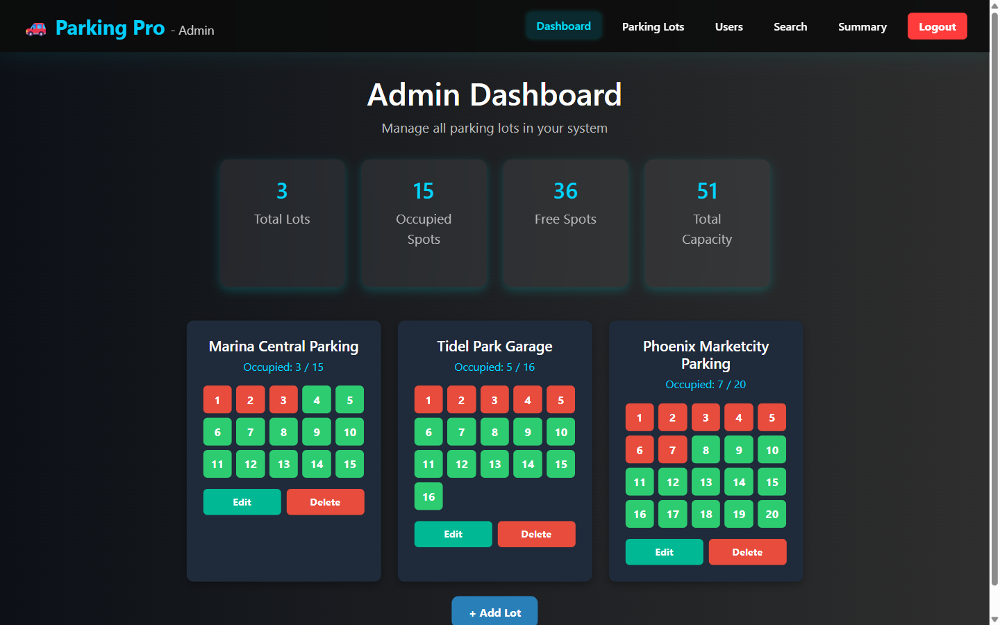
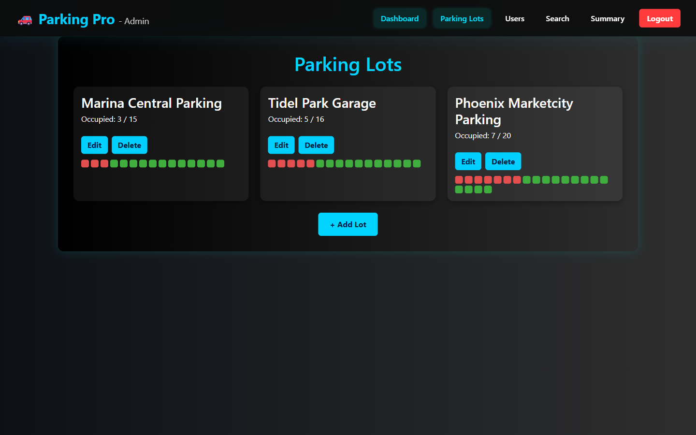
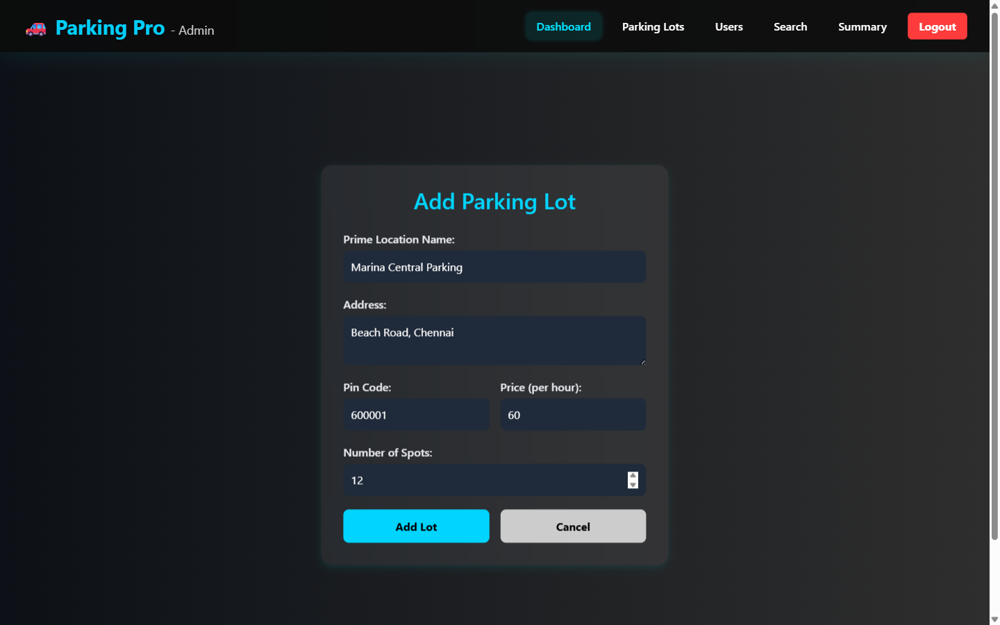
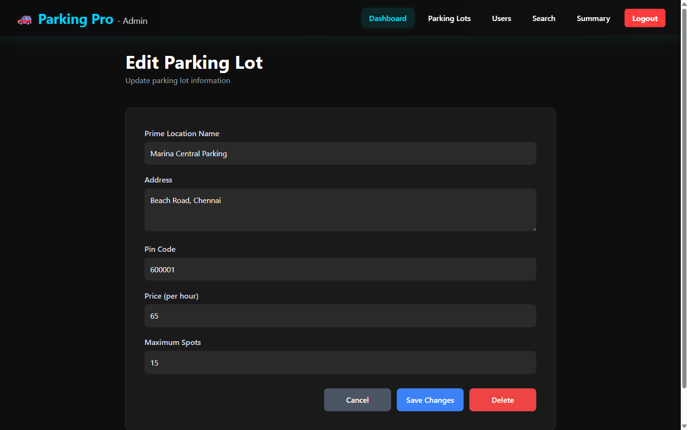
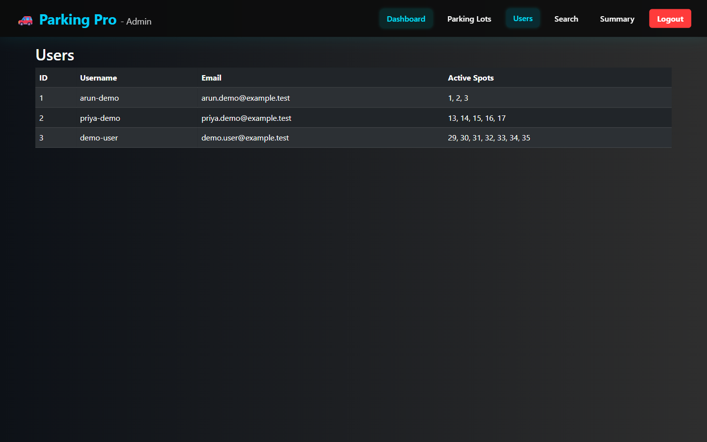
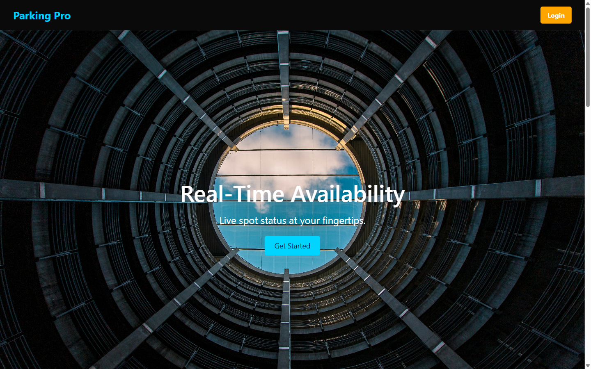
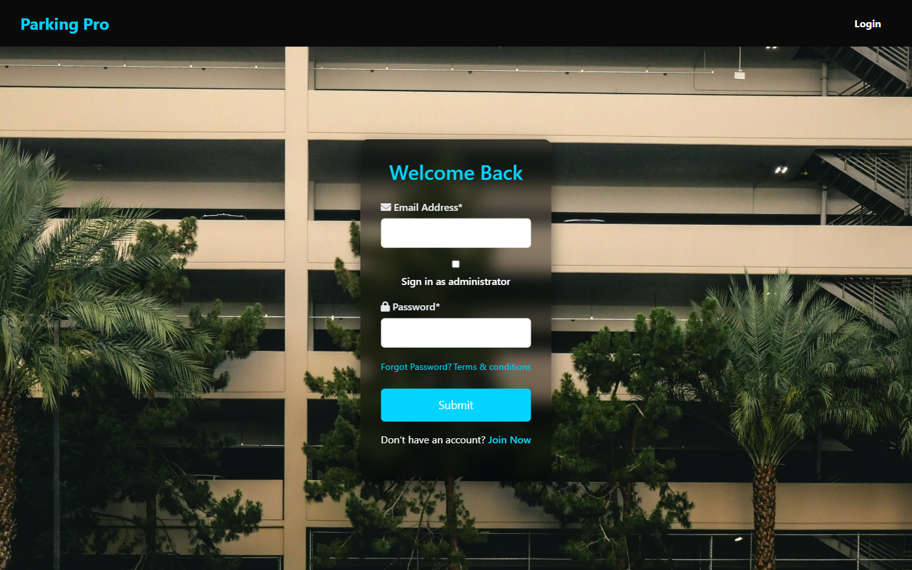

# ParkingPrro

ParkingPrro is a full-stack vehicle parking management application with a Vue 3 frontend and a Flask REST API. The verified application supports user registration and login, role-aware JWT authentication, and protected admin workflows for managing parking lots, spot capacity, occupancy, and registered users.

## Screenshots

### Admin Parking Dashboard



### Parking Lot Management



### Add a Parking Lot



### Edit a Parking Lot



### Registered Users



### Landing Page



### Authentication



## Features

- User registration with vehicle and contact details
- User and administrator login through separate API paths
- JWT authentication with backend-enforced admin role checks
- Protected parking-lot listing, creation, editing, and deletion
- Automatic creation and capacity management of parking spots
- Occupied and available spot totals per lot and across the dashboard
- Admin view of registered users and their active spot IDs

## Architecture

```text
Vue 3 frontend
      │
      │ Axios / REST
      ▼
Flask API + JWT authorization
      │
      │ Flask-SQLAlchemy
      ▼
SQLite
```

Redis and Celery are present in the backend dependencies, and a Redis URL is configured for future caching or background-job use. The current repository does not initialize a Celery application, define tasks, or make Redis cache calls, so neither service is required for the verified admin workflow.

## Tech Stack

**Frontend**

- Vue 3
- Vue Router 4
- Axios
- Bootstrap 5
- Font Awesome

**Backend**

- Flask
- Flask-SQLAlchemy
- Flask-JWT-Extended
- Werkzeug password hashing

**Data and supporting dependencies**

- SQLite
- Redis client
- Celery

## Core Engineering Concepts

- REST API separation between the Vue client and Flask server
- JWT issuance and role-based authorization
- Relational modelling for users, parking lots, parking spots, and reservations
- Parking-lot capacity changes that preserve occupied spots
- Cascading lot-to-spot persistence through SQLAlchemy relationships
- Client-side route protection and authenticated API requests

## Local Setup

### Backend

From the repository root in PowerShell:

```powershell
cd backend
python -m venv .venv
.\.venv\Scripts\Activate.ps1
pip install -r requirements.txt

$env:JWT_SECRET_KEY = "choose-a-local-development-secret"
$env:ADMIN_USERNAME = "choose-a-local-admin-name"
$env:ADMIN_PASSWORD = "choose-a-local-admin-password"

python create_db.py
python app.py
```

The API starts at `http://127.0.0.1:5000`.

### Frontend

In a second PowerShell terminal:

```powershell
cd frontend
npm install
npm run serve
```

The Vue development server starts at `http://127.0.0.1:8080` and proxies `/api` requests to Flask.

### Verification

```powershell
cd frontend
npm run lint
npm run build
```

The local SQLite database, virtual environment, installed Node modules, and build output are ignored by Git.
