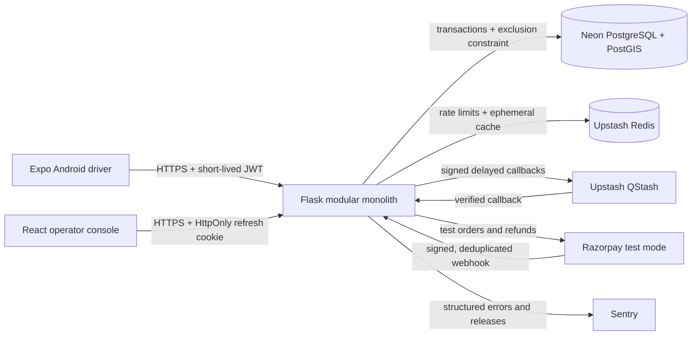

# ParkingPro architecture

**Status:** Implemented

ParkingPro uses a modular monolith. The deployment is intentionally small while
the domain boundaries, contracts, and operational controls remain explicit.

```text
Expo Android app ───────────────┐
                               ├── HTTPS ── Flask API ── PostgreSQL + PostGIS
React operator console ────────┘                 │
                                                 ├── Upstash Redis
Razorpay test webhooks ──────────────────────────┤
QStash signed callbacks ─────────────────────────┤
                                                 └── Sentry / JSON logs
```



## Repository boundaries

- `apps/mobile`: device navigation, secure credential storage, offline pass cache,
  camera/location/notification integrations, and driver presentation logic.
- `apps/operator-web`: operator presentation, role-aware navigation, polling, QR
  scanning, and reporting. Authorization remains server-side.
- `backend`: HTTP contract, authentication, authorization, domain services,
  persistence, provider integrations, and OpenAPI generation.
- `packages/api-contracts`: generated TypeScript types from the Flask OpenAPI file.
- `packages/design-tokens`: platform-neutral colour, spacing, radius, and motion data.

## Request flow

1. Clients call a fixed allowlisted API origin and send a short-lived access token.
2. Flask validates schema, identity, role, ownership, and idempotency before calling
   a domain service.
3. Domain services run state transitions inside database transactions; PostgreSQL
   constraints are the final concurrency authority.
4. Provider calls are verified, deduplicated, and recorded before state changes.
5. Responses use a request ID and stable error code; secrets and PII are redacted.

## Availability strategy

The early release uses ten-second operator polling. The Render free API may sleep;
clients expose an explicit warm-up state with capped exponential retry. QStash is
used for delayed HTTP work because a continuously running free Celery worker is
not available. These are documented constraints, not hidden production claims.
