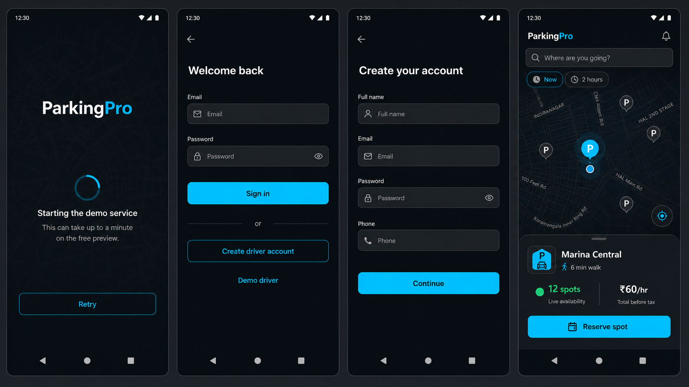
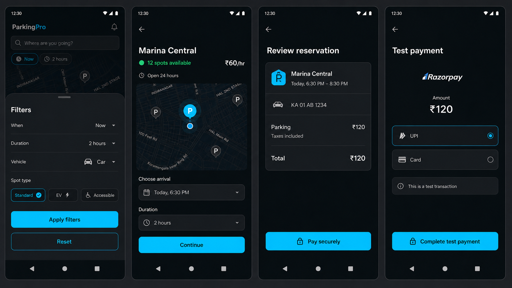
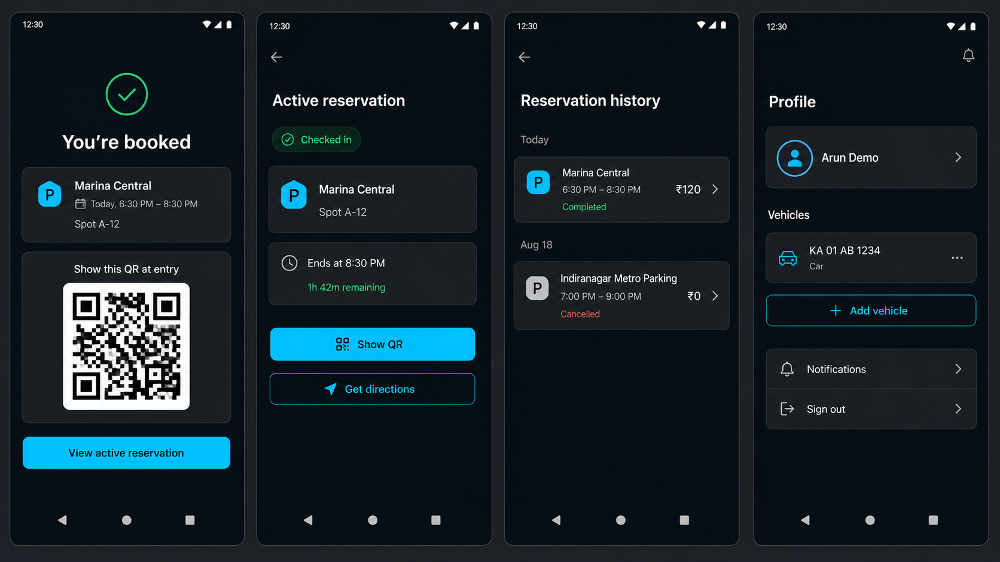
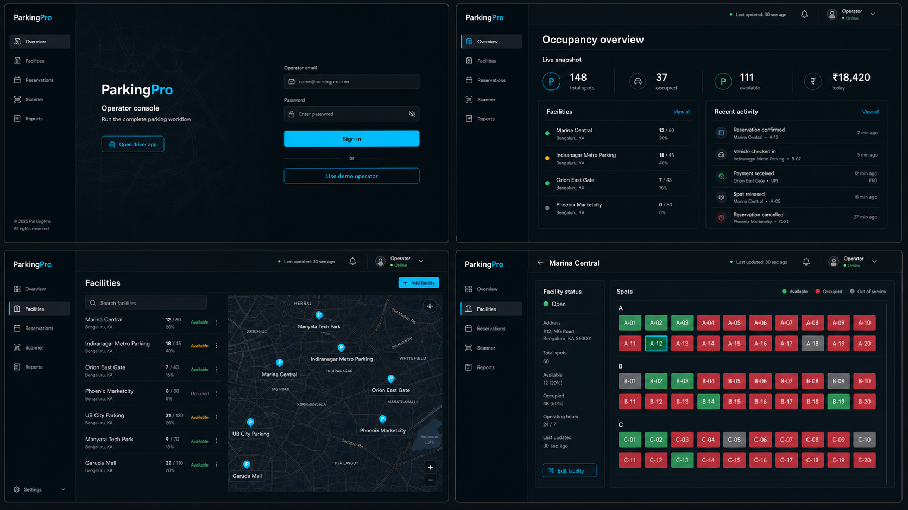
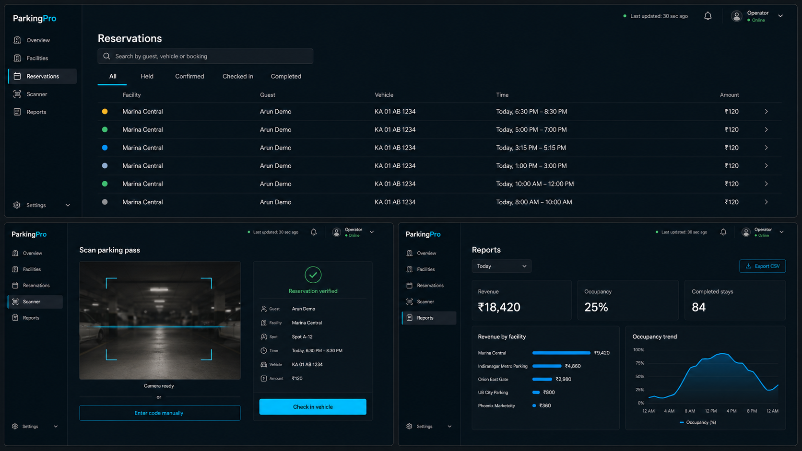

# ParkingPro design system

**Status:** Implemented

## Thesis

ParkingPro feels like a precise urban navigation instrument: dark graphite maps,
crisp off-white typography, cyan interaction energy, green reserved for confirmed
availability, and calm operational surfaces.

## Content and interaction

- Mobile starts with the map; sheets provide contextual action without replacing it.
- Operator pages start with the working surface, not a marketing hero or card grid.
- Motion communicates place or state: map camera, sheet spring, booking progress,
  QR reveal, shared row/detail transition, and KPI change.
- `prefers-reduced-motion` and the native reduced-motion setting remove nonessential
  movement while preserving state feedback.

## Foundation tokens

```text
ink.950       #050B0F     primary background
ink.900       #081117     navigation / elevated background
ink.800       #111C22     interactive surface
ink.600       #46545D     disabled / quiet border
paper.50      #F4F7F8     primary text
paper.300     #AEB9BF     secondary text
cyan.500      #08C7F4     primary action / selection
green.500     #2EDB84     available / confirmed / healthy
amber.500     #F6B84A     held / attention
red.500       #EF5B63     destructive / failed
```

Use Inter for product UI and JetBrains Mono only for identifiers, booking codes,
and operational timestamps. Minimum touch target is 44×44 px; body copy is never
below 14 px web / 16 sp mobile. Prefer layout, dividers, and whitespace to cards.

## Approved review boards

### Mobile foundation



### Mobile booking



### Mobile reservations and profile



### Operator core workspace



### Operator operations and reporting



The boards define hierarchy and art direction, not literal pixel measurements or
production data. Accessibility and platform-native behaviour override decorative
details when they conflict.
